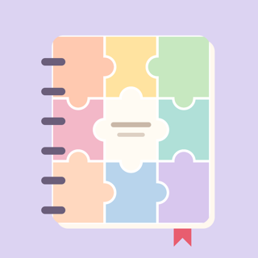
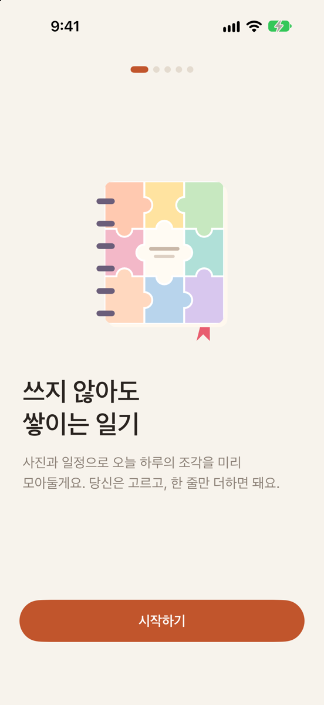
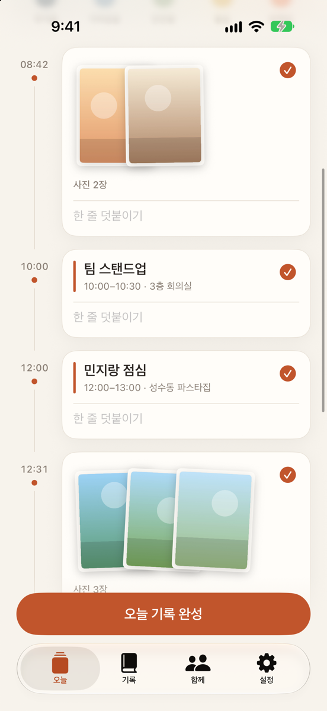
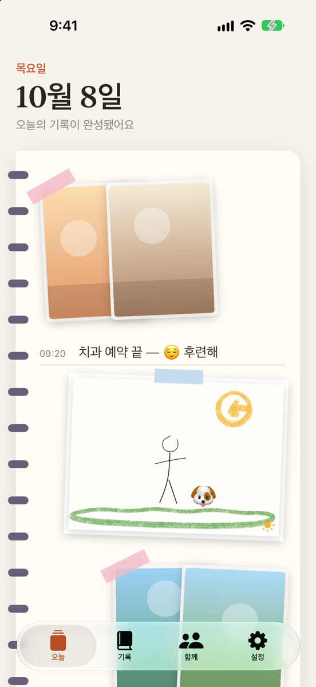
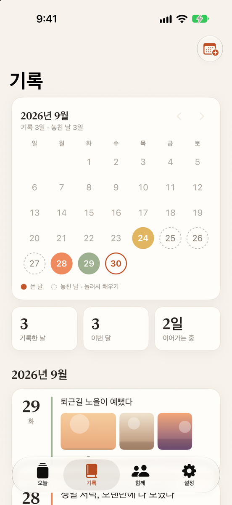
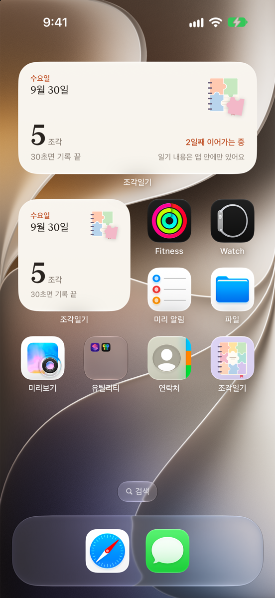
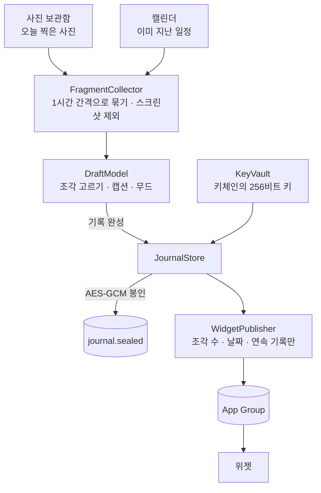
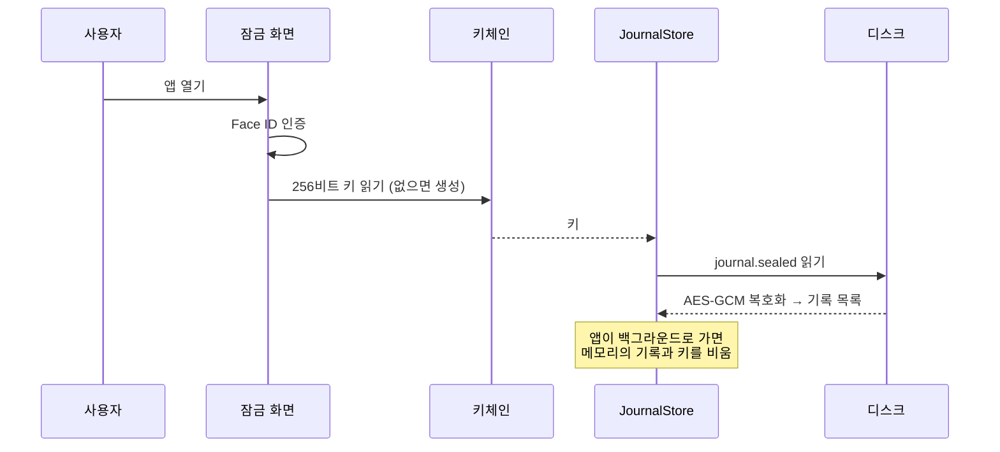
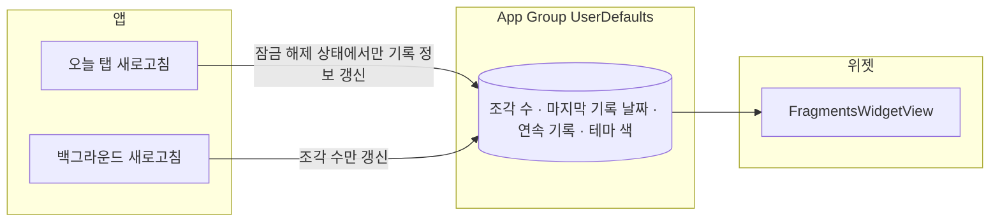

<p align="center">
  
</p>

<h1 align="center">조각일기</h1>

<p align="center">
  빈 페이지 대신 <b>오늘 하루의 조각</b>이 먼저 기다리는 iPhone 일기 앱<br>
  사진과 지나간 일정이 알아서 모이고, 고른 다음 한 줄만 더하면 기록이 끝나요.
</p>

<p align="center">
  
  
  
  
  
</p>

---

## 주요 기능

- **조각 자동 수집**: 오늘 찍은 사진(1시간 안에 찍은 사진은 한 묶음, 스크린샷 제외)이 시간순 타임라인으로 모여 있어요.
- **오늘의 질문**: 이미 지난 캘린더 일정과 미리 알림에서 끝낸 일을 그대로 베껴 보여주지 않고 "‘민지랑 점심’, 어땠어요?", "‘치과 예약’을 끝냈네요!" 같은 질문으로 바꿔요. 오늘 화면에는 요약 한 줄만 있고, 누르면 질문 카드를 한 장씩 넘기며 감정 버튼 한 번이나 한 줄로 답해요. 답한 질문만 일기에 들어가요.
- **고르고 한 줄만**: 조각을 체크하고 원하면 한 줄씩 덧붙이면 끝이에요. 메모 조각, 사진 추가, 무드(오늘의 결)도 고를 수 있어요.
- **공책 한 장에 붙인 하루**: 기록을 완성하면 오늘 탭이 스프링 공책 한 장이 돼요. 위에는 사진과 그림이 테이프로 붙인 작은 인화지처럼 나란히, 아래 줄에는 질문의 답과 메모가 시간순으로 쓰여 하루가 한 화면에 들어와요. 사진과 그림은 콜라주처럼 꾸밀 수 있어요. 길게 누른 채 끌면 원하는 곳으로 옮겨지고(서로 겹쳐도 돼요), 두 손가락으로 크기를 자유롭게 바꿔요. 마지막에 만진 것이 위로 올라오고, 배치는 기록에 저장돼요. "자동 정렬"로 언제든 처음 배치로 되돌릴 수 있어요. iPad에서는 기본 크기가 더 커요. 기록 탭의 상세 화면도 같은 모습이에요.
- **그림 그리기 조각**: 쓰는 화면의 "메모 · 사진" 옆 "그림"를 누르면 날짜·날씨 칸, 그림 칸, 원고지 칸이 있는 그림일기 공책이 열려요. 연필·크레용·형광펜·펜으로 그리고 스티커를 붙이면, 그림이 타임라인에 조각으로 들어가요. 눌러서 이어 그릴 수 있어요.
- **사진 꾸미기**: 일기에 넣은 사진 위에 그림을 그리거나 이모지·글자 스티커를 붙여요. 원본 사진은 그대로 두고 꾸민 사본만 암호화해 저장하며, 나중에 다시 열어 고칠 수 있어요.
- **iPad와 Apple Pencil**: iPad에서도 실행돼요. 펜슬 더블탭으로 지우개 전환, "Apple Pencil로만 그리기" 설정을 따라요. iPhone에서는 손가락으로 그려요.
- **한 줄 모드**: 바쁜 날엔 무드와 한 줄만으로 기록이 완성돼요. 사진이 가장 많은 묶음이 커버로 붙어요.
- **놓친 날 채우기**: 최근 7일 중 기록이 없는데 조각이 남은 날을 오늘 탭 배너로 알려줘요. 기록 탭 달력에서 아무 날이나 골라 채울 수도 있어요.
- **한 달 캘린더**: 쓴 날은 무드 색으로, 놓친 날은 점선으로 보여요. 누르면 그날 기록이 열리거나 바로 채우기가 시작돼요.
- **위젯**: 홈 화면(작은·중간)과 잠금 화면(원형·사각형·한 줄). 오늘 모인 조각 수와 연속 기록만 보여주고 일기 내용은 표시하지 않아요.
- **함께 쓰는 폴더**: 가족·친구와 쓸 폴더를 만들고, 고른 조각만 올려요. 폴더의 글도 오늘 탭과 같은 공책 한 장으로 보이고, 내가 올린 글은 사진·그림을 길게 눌러 옮기고 두 손가락으로 크기를 바꿔 꾸밀 수 있어요(일기에서 꾸민 배치가 그대로 따라가요). 아무것도 미리 선택되지 않아서 개인 일기가 실수로 올라가지 않아요. *(동기화는 아직 연결 전: [알려진 제한](#알려진-제한) 참고)*
- **잠금과 암호화**: Face ID 잠금, 앱 전환 화면 가리기, 모든 기록을 AES-256으로 암호화해 기기에만 저장해요.
- **테마 색**: 6가지 색과 직접 고르기. 고른 색은 위젯에도 적용되고, 너무 옅은 색은 글씨가 읽히도록 자동 보정돼요.
- **저녁 알림**: "오늘 일정 2개와 끝낸 일 1개가 있었어요"처럼 그날에 맞춰 문구가 바뀌고, 누르면 질문 카드가 바로 열려요. 잠금 화면에는 기본적으로 일정 이름을 보이지 않아요(설정에서 켤 수 있어요). 이미 기록한 날엔 울리지 않아요.

## 요구 사항

| 항목 | 버전 |
|---|---|
| iOS | 17.0 이상 |
| Xcode | 26 이상 (Xcode 27에서 개발) |
| Swift | 6 (기본 액터 격리: MainActor) |
| 외부 라이브러리 | 없음 |

---

## 전체 동작 흐름

사진과 일정이 조각이 되고, 기록이 암호화돼 저장되고, 위젯에는 숫자만 전달되기까지의 과정이에요.



### 1. 조각 모으기

코드: [`FragmentCollector.swift`](FragmentDiary/Services/FragmentCollector.swift)

| 출처 | 규칙 |
|---|---|
| 사진 | 오늘 찍은 사진을 시간순으로 보고, 앞 사진과 **1시간 이내**면 같은 순간으로 묶어요. 스크린샷은 빼요. 한 묶음은 최대 30장. |
| 캘린더 | **이미 시작한 일정만** 질문으로 가져와요. 앞으로의 계획은 일기에 섞이지 않게요. 생일 캘린더와 공휴일 같은 구독 캘린더도 빼요. |
| 미리 알림 | 그날 **완료한** 할 일만 "끝냈네요!" 질문으로 가져와요. 최근 7일 치를 미리 읽어 두어 놓친 날 채우기에서도 쓸 수 있어요. |

오늘 탭을 열 때, 앱으로 돌아올 때, 권한이 바뀔 때 다시 모아요.
이미 쓴 캡션은 유지하면서 새로 생긴 조각만 합쳐요([`DraftModel.merge`](FragmentDiary/Features/Today/DraftModel.swift)).
기록을 완성한 뒤 새 조각이 생기면 "새 조각 N개가 더 모였어요"로 알려줘요.

### 2. 저장과 암호화

코드: [`JournalStore.swift`](FragmentDiary/Services/JournalStore.swift), [`SealedFile.swift`](FragmentDiary/Services/SealedFile.swift), [`KeyVault.swift`](FragmentDiary/Services/KeyVault.swift)



| 장치 | 목적 |
|---|---|
| **파일 하나를 통째로 봉인** | 캡션뿐 아니라 날짜·무드까지 암호화돼요. 디스크에서 어떤 글자도 보이지 않아요. |
| **파일 보호(completeFileProtection)** | 기기가 잠겨 있을 때는 iOS 수준에서도 파일을 열 수 없어요. |
| **백그라운드 진입 시 잠금** | 메모리의 기록과 키를 비우고, 앱 전환 화면에는 앱 이름만 보여요. |
| **모두 삭제 = 키 파기** | 파일과 함께 키체인의 키도 지워서, 남은 사본이 있어도 읽을 수 없어요. |
| **폴더 사진도 봉인** | 폴더에 올린 사진은 JPEG로 복사해 같은 키로 암호화해 저장해요. |
| **그림·꾸민 사진도 봉인** | 그림일기와 꾸민 사진은 완성 이미지와 다시 고칠 수 있는 레이어(획·스티커)를 `JournalAttachments/`에 같은 키로 따로 봉인해요. 기록을 지우면 함께 지워지고, 어디에도 쓰이지 않는 파일은 잠금을 풀 때 정리돼요. |

### 3. 기록하기

| 상황 | 흐름 | 코드 |
|---|---|---|
| 오늘 | 조각 체크 → 캡션(선택) → 무드(선택) → 완성 | [`TodayView`](FragmentDiary/Features/Today/TodayView.swift), [`ComposerView`](FragmentDiary/Features/Today/ComposerView.swift) |
| 바쁜 날 | "한 줄로" → 무드와 한 줄 → 완성 | 같음 |
| 그림으로 | "그림 그리기" → 그리기·스티커·날씨·원고지 한 줄 → 완료 (그림 조각으로 타임라인에 들어가요) | [`DrawingEditorView`](FragmentDiary/Features/Drawing/DrawingEditorView.swift) |
| 다시 보기 | 완성한 날은 공책 한 장으로 보여요 | [`JournalPageView`](FragmentDiary/Features/History/JournalPageView.swift) |
| 사진 꾸미기 | 사진 조각의 "꾸미기" → 그리기·스티커 → 완료 | [`PhotoDecoratorView`](FragmentDiary/Features/Decorate/PhotoDecoratorView.swift) |
| 놓친 날 | 배너 또는 달력에서 날짜 선택 → 그날 남은 조각으로 작성 | [`BackfillViews`](FragmentDiary/Features/Backfill/BackfillViews.swift), [`MonthCalendarView`](FragmentDiary/Features/History/MonthCalendarView.swift) |
| 수정·삭제 | 기록 탭 → 상세 → 메뉴 | [`EntryDetailView`](FragmentDiary/Features/History/EntryDetailView.swift) |

나중에 채운 기록에는 "나중에 채움" 표시가 붙고, 연속 기록 일수에도 포함돼요.
달력에서 첫 기록 이전 날짜는 "놓친 날"로 세지 않아요.

### 4. 앱 ↔ 위젯 데이터 공유

코드: [`WidgetSnapshot.swift`](Shared/WidgetSnapshot.swift), [`WidgetPublisher.swift`](FragmentDiary/Services/WidgetPublisher.swift)



> 위젯에는 **숫자와 날짜만** 넘겨요. 일기 내용, 캡션, 사진은 위젯으로 절대 전달되지 않아요.
> 자정에 새 날로 넘어가는 항목을 타임라인에 미리 넣어 두어서, 앱을 열지 않아도 날짜가 바뀌어요.

### 5. 함께 쓰는 폴더

코드: [`FolderStore.swift`](FragmentDiary/Services/FolderStore.swift), [`FolderSync.swift`](FragmentDiary/Services/FolderSync.swift)

폴더와 폴더 글은 개인 일기와 **별도 파일**(`folders.sealed`)에 같은 방식으로 암호화돼요.
초대와 동기화는 `FolderSync` 프로토콜 뒤에 있고, 지금 구현은 "연결 안 됨"(`UnconnectedFolderSync`)이라 폴더는 이 기기에만 있어요.
앱도 그 사실을 화면에 그대로 알려줘요. CloudKit 폴더별 공유를 이 자리에 끼울 계획이에요.

---

## 프로젝트 구조

```
FragmentDiary/
├─ FragmentDiary/                  앱 (SwiftUI)
│  ├─ App.swift                    진입점, 잠금·온보딩·탭 전환, 테마 적용
│  ├─ DesignSystem/                카드·버튼·타임라인·사진 콜라주 등 공용 컴포넌트
│  ├─ Features/
│  │  ├─ Today/                    오늘 탭, 조각 작성 화면, 초안 모델
│  │  ├─ Drawing/                  그림일기 공책, 그림 편집기
│  │  ├─ Decorate/                 PencilKit 캔버스, 스티커, 사진 꾸미기, 이미지 합성
│  │  ├─ Backfill/                 놓친 날 채우기(배너, 날짜 선택)
│  │  ├─ History/                  기록 목록, 한 달 캘린더, 상세
│  │  ├─ Folders/                  함께 쓰는 폴더
│  │  ├─ Onboarding/               첫 실행 안내 5단계와 권한 요청
│  │  ├─ Lock/                     Face ID 잠금 화면
│  │  └─ Settings/                 설정, 테마 색, 위젯 미리보기(디버그)
│  ├─ Models/                      일기·조각·무드, 폴더·멤버·글
│  └─ Services/                    조각 수집, 암호화 저장소, 키체인, 알림,
│                                  백그라운드 새로고침, 위젯 게시, 내보내기
├─ FragmentDiaryWidget/            위젯 익스텐션 (타임라인 제공자)
├─ Shared/                         앱과 위젯이 함께 쓰는 코드
│                                  (색·날짜 형식, 테마, 위젯 화면, 위젯 스냅샷)
├─ Tools/
│  ├─ GenerateAppIcon.swift        앱 아이콘(라이트·다크·틴트) 생성
│  └─ MakeSamplePhotos.swift       시뮬레이터용 오늘 날짜 샘플 사진 생성
└─ docs/images/                    README 스크린샷
```

**설계 원칙**

- **빈 페이지를 없애기**: 사용자가 쓰기 전에 앱이 먼저 모아 두고, 사용자는 고르기만 해요. 글은 선택이에요.
- **죄책감 없는 기록**: 연속 기록은 2일 이상일 때만 조용히 보여주고, 놓친 날은 혼내지 않고 채울 기회로 보여줘요.
- **기기 밖으로 나가지 않기**: 계정·서버·분석 도구가 없어요. 공유는 사용자가 고른 것만, 명시적으로요.
- **외부 라이브러리 없음**: PhotoKit, EventKit, CryptoKit, LocalAuthentication, WidgetKit, PencilKit만 써요.

---

## 실행 방법

### 시뮬레이터

1. `FragmentDiary.xcodeproj`를 Xcode로 열어요.
2. 스킴 **FragmentDiary**, 기기를 iPhone 시뮬레이터로 고르고 **⌘R**.
3. 온보딩에서 사진·캘린더·알림을 허용해요.

샘플 데이터가 있으면 조각 수집을 바로 볼 수 있어요.

```bash
swift Tools/MakeSamplePhotos.swift /tmp/samples && xcrun simctl addmedia booted /tmp/samples/*.jpg
```

| 디버그 빌드 전용 | 설명 |
|---|---|
| 실행 인자 `-seedSampleEvents` | 오늘·어제 날짜로 샘플 캘린더 일정과 끝낸 미리 알림을 넣어요. |
| 실행 인자 `-removeSampleData` | 넣었던 샘플 일정과 샘플 사진을 지워요. |
| 잠금 화면의 "잠금 건너뛰기" | 시뮬레이터에서 Face ID를 흉내 내지 않고 바로 열어요. |
| 설정 › 디버그 › 위젯 미리보기 | 위젯 5가지 크기를 앱 안에서 바로 확인해요. |

> 시뮬레이터에서 Face ID를 실제로 테스트하려면 Simulator 메뉴 **Features › Face ID › Enrolled**를 켜고,
> 인증 창이 뜨면 **Matching Face**(⌘⇧M)를 보내요.

### 실기기

1. 아이폰을 연결하고 **설정 › 개인정보 보호 및 보안 › 개발자 모드**를 켜요.
2. **FragmentDiary**, **FragmentDiaryWidgetExtension** 두 타깃의 **Signing & Capabilities**에서
   - Team을 본인 계정으로 선택
   - Bundle Identifier의 `com.jonghwa`를 본인만의 이름으로 변경
   - App Group 이름도 같이 변경(`*.entitlements`, [`WidgetSnapshot.appGroup`](Shared/WidgetSnapshot.swift))
3. 기기를 아이폰으로 고르고 **⌘R**.

---

## 알려진 제한

| 항목 | 내용 |
|---|---|
| 함께 쓰는 폴더 | 초대·동기화가 아직 연결되지 않아 폴더는 이 기기에만 있어요. CloudKit 연결에는 유료 Apple Developer Program 계정이 필요해요. |
| 무료 개발자 계정 | App Group을 지원하지 않을 수 있어, 위젯이 앱 데이터를 못 읽을 수 있어요. |
| 실기기 미검증 | 잠금 화면 위젯 배치, 저녁 알림 실제 발송, 백그라운드 새로고침, 앱 전환 화면 가리기는 시뮬레이터에서만 확인했거나 확인하지 못했어요. |
| 암호화 백업 | 텍스트(Markdown) 내보내기만 있고, 암호화 백업·복원은 아직 없어요. 내보낸 텍스트는 암호화되지 않아요. |
| 자동 테스트 | 아직 없어요. 시뮬레이터에서 기능을 직접 돌려 확인했어요. |
| 언어 | 한국어만 지원해요. |
| Apple Pencil | 필압·더블탭은 실제 iPad와 펜슬에서 확인하지 못했어요(시뮬레이터에서는 손가락 입력으로만 확인). |

## 개인정보

- 사진과 캘린더는 **기기 안에서만** 읽어요. 어디에도 올리지 않아요.
- 모든 기록은 키체인에 보관된 키로 **AES-256-GCM 암호화**해 이 기기에만 저장해요.
- 계정, 서버, 광고·분석 도구가 없어요.
- 위젯에는 조각 수와 날짜만 전달하고 일기 내용은 전달하지 않아요.
- "모든 기록 삭제"는 암호화 키까지 파기해서 되돌릴 수 없어요.

---

## 개발 과정

컨셉부터 지금 모습까지의 흐름이에요. 커밋 기록에 각 단계가 그대로 남아 있어요.

1. **컨셉**: 시중 일기 앱(빈 텍스트 박스 + 사진 첨부)과 다르게 가기 위해 "쓰지 않아도 쌓이는 일기(Zero Writing Friction)"로 정했어요. 플랫폼은 사진·캘린더·Face ID 통합이 자연스러운 iOS 네이티브(SwiftUI)로.
2. **MVP**: 조각 자동 수집 → 고르기 → 한 줄 → 저장의 핵심 흐름과, 처음부터 암호화·Face ID 잠금을 함께 만들었어요.
3. **놓친 날 채우기**: 기록을 놓친 날도 남은 조각으로 채울 수 있게 했어요. 테스트하다 공휴일 캘린더가 조각으로 들어오는 문제를 찾아 뺐어요.
4. **위젯**: 홈·잠금 화면 위젯. 위젯에는 숫자만 넘기도록 App Group 스냅샷을 따로 두었어요.
5. **함께 쓰는 폴더**: 로컬 구조와 화면을 먼저 만들고, 동기화는 프로토콜 자리만 두었어요.
6. **아이콘과 테마**: 아이콘은 카드 → 퍼즐 조각 한 개 → 여러 조각 → 꽉 찬 퍼즐을 거쳐, 후보 5개 중 **퍼즐 표지 일기장**으로 정했어요. 테마 색은 6가지 + 직접 고르기.
7. **다듬기**: 위젯 그림을 "마지막 조각을 끼우는 노트"로, 앱 안 그림을 아이콘과 같은 그림으로 통일했어요. (7조각 요일 퍼즐도 시도했다가 되돌렸어요.)
8. **전체 점검과 캘린더**: 새로 설치해 처음부터 전 기능을 돌리며 버그 2개를 고치고, 쓴 날·놓친 날이 보이는 한 달 캘린더를 추가했어요.
9. **그림일기와 사진 꾸미기**: "글이 아니라 그림으로 하루를 남기고 싶다"는 요청으로 그림 탭을 더했어요. 시안 3개(그림일기 공책·스케치북·앨범) 중 앨범으로 모아 보고 공책에 그리는 조합을 골랐어요. 같은 캔버스로 사진 위에 그리기·스티커도 붙일 수 있게 했고, iPad와 Apple Pencil을 지원해요.
10. **일정을 질문으로**: 일정 카드가 캘린더 앱과 겹친다는 피드백으로, 일정과 미리 알림의 끝낸 일을 "어땠어요?" 질문으로 바꿨어요. 타임라인 속 카드·한 장씩 넘기는 카드·질문 묶음 시안을 비교한 뒤, 화면이 길어지지 않는 "요약 한 줄 → 질문 시트" 방식을 골랐어요.
11. **공책 한 장에 붙인 하루**: 오늘 탭을 "내가 쓴 것을 보여주는 오늘의 페이지"로 바꿨어요. 퍼즐 보드 시안은 조잡하다는 피드백으로 버리고, 크고 단순한 공책 시안 3개 중 사진·글·그림을 스프링 공책에 붙이는 안을 골랐어요. 그림 탭은 없애고 "그림 그리기" 조각으로 합쳐 탭을 4개로 줄였어요.
